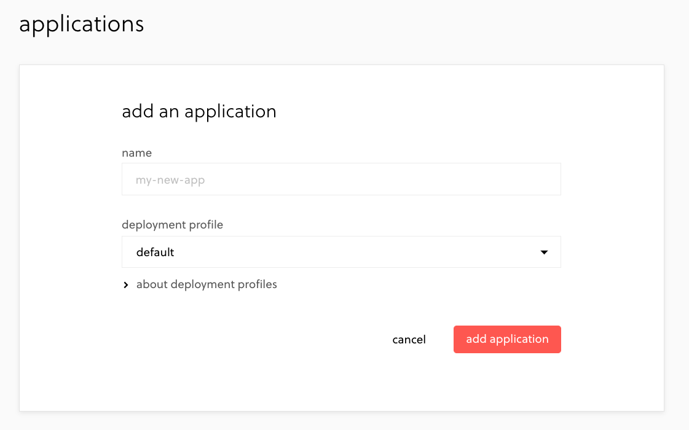
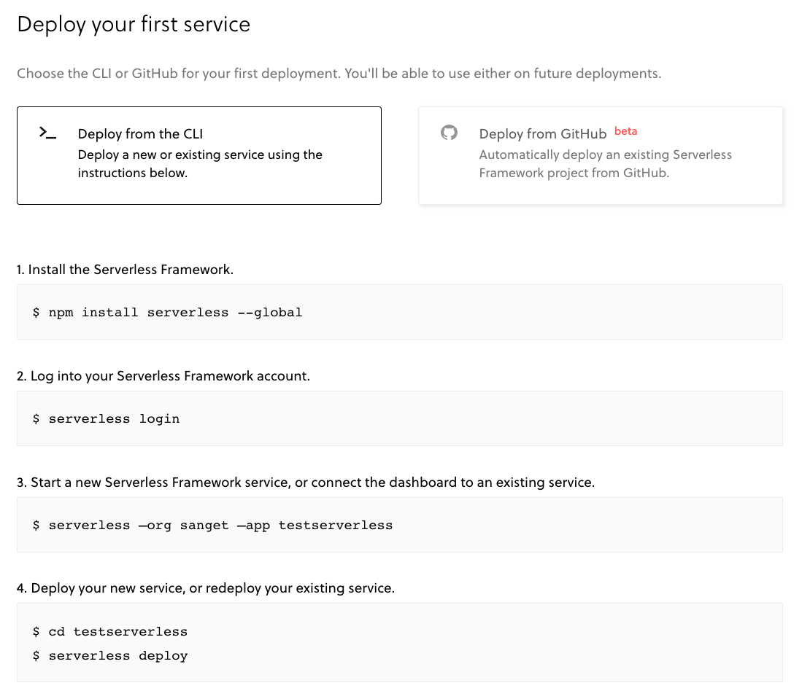

最近趁着闲暇时间研究了一下 AWS 的各种服务，并且记录了如何通过 serverless.js 管理 serverless 服务的开发和部署。

## 概览

1. serverless 的基本认识
2. AWS 的 serverless 开发和部署
3. AWS 各服务之间协调、配置
   1. API Gateway：处理 API 并转发到 Lambda
      1. AWS Route 53：为 API 自定义域名
   2. Lambda Node：使用 Node 函数处理业务逻辑
   3. DynamoDB：NoSQL 数据库
   4. IAM：用户权限配置，用于协调 API Gateway、Lambda、DynamoDB 之间的调用关系

> 参考：https://aws.amazon.com/cn/getting-started/projects/build-serverless-web-app-lambda-apigateway-s3-dynamodb-cognito/
> 这是基于 AWS 的 Lambda + DynamoDB + S3 + Cognit 实现的一个提供完整用户注册、验证的 serverless 的 demo 应用

参考 AWS 官方教程，跟着完成它可以对 AWS 提供的各种服务有大致了解，包括 AWS 各个服务之间是如何合作的，以及 AWS 对 serverless 的定义。


> 亚马逊的基础设施做的相当好。

## 准备

> 账号

1. AWS 账号（非中国区），并且登陆到 AWS 的 dashboard。
2. 到 `serverless.com` 注册并登陆，并且关联 AWS 的 IAM 的用户。[官网](https://serverless.com/)有详细教程。

> 概念

- `serverless`: 由云计算平台提供的 API Gateway + Function runner + DB + Static storage + Authorization 等一系列服务组成的服务应用架构。例如 AWS 的 Lambda + DynamoDB + S3 + Cognit。
- `serverless.js`: 一个基于 Node 的 serverless 应用的管理工具，提供应用开发环境、应用部署等功能。

## 开始

在 serverless.com 添加一个 serverless app



然后进入该 app，跟着详细步骤操作



然后得到一个基础的 serverless 项目

```treeview
+-- handler.js
+-- serverless.yml
```

这个时候已经可以将应用部署到 AWS 了。

## 开发

虽然 Lambda 是函数，但是我们可以按照 Node 应用的方式来进行开发。

在项目目录添加 package.json，并且安装依赖。以下例子基于 typescript：

```shell
# AWS 提供的 sdk
# 建议放入 devDependencies 中，否则部署应用时会把所有 aws-sdk 代码放入 deployment package 中，至少 6M 的包大小。
# 这是 Lambda 正式运行环境中自带的。
yarn add aws-sdk -D

# 依赖关键的插件
yarn add -D serverless-dynamodb-local serverless-offline serverless-plugin-typescript typescript
```

在 serverless.yml 文件中添加 plugins 的引用：

```yml
# 需要注意引用顺序
plugins:
  - serverless-plugin-typescript
  - serverless-dynamodb-local
  - serverless-offline
```

如果需要用到数据存储，则需要安装 local dynamoDB：

```shell
# 通过 serverless 提供的 cli 安装 dynamodb 到本地
sls dynamodb install

# 启动 dynamoDB 服务
sls dynamodb start
```

最后开启本地模拟 lambda 调试服务即可

```shell
sls offline
```

说明下几个关键的 plugin：

- `serverless-dynamodb-local` 将 dynamoDB 安装到本地作为开发环境使用，模拟 dynamoDB
- `serverless-offline` 将启动本地服务调试 handler 的 apis，模拟 lambda
- `serverless-plugin-typescript` 将 ts complie 成执行的 js

## 部署

如果是第一次部署应用，则需要运行 `sls deploy` 命令，serverless.js 会根据登陆的用户在 AWS 中创建对应的服务，并且部署全部的 Lambda 函数，同时也需要花一定的时间。

到后续的持续部署，则可以私用 `sls deploy function -f functionName` 来部署某个具体函数，也节省时间。注意：如果还没部署的函数使用此方法部署，会出现找不到函数的错误。

```shell
# 部署整个 handler
sls deploy --stage prod

# 直接部署指定函数
sls deploy function -f functionName --stage prod
```

- 更多参考：https://serverless.com/framework/docs/providers/aws/cli-reference/deploy-function/

## 进阶

上述只到走了简单的从开发到部署流程，但远远不到可以应用到生产环节的程度，实际情况要比这复杂的多。

### CORS 与 Custom http headers

在客户端需要与 API Gateway 交互的时候，需要配置 CORS。本地开发的时候由于 serverless-offline 默认开起 CORS，且没有模拟 API Gateway 的转发策略，所以开发起来比较顺畅，都是到了真实环境后会有 CORS 和函数无法获取 custom http header 的问题。

在 serverless.yml 配置中添加 handler 的 http 配置：

```yml
functions:
  handler1:
    handler: handler.handler1
    events:
      - http:
          path: path/to/handle
          method: get
          cors:
            origin: '*'
            headers:
              - Content-Type
              - Access-Control-Allow-Headers
              - Access-Control-Allow-Origin
              - Custome-Header
            allowCredentials: false
```

注意：在 handler1 中，想要获取 CustomeHeader 必须全小写。

```js
// handler.ts
export const handler1 = async (event, context) => {
  // 需要通过小写的 custom-header 获取
  const customHeader = event.headers['custom-header'];
}
```

### 使用 DynamoDB

一般来说，都是轻量级的应用会选择 serverless 架构，所以一般来说 DynamoDB 足够支撑。

参考入门教程：https://amazonaws-china.com/cn/dynamodb/getting-started/

DynamoDB 由 map 结构的 properties 组成 item, 多个 item 组成 table。例如一个用于记录人员的 people 表的数据结构如下：

```ts
// table people
{
  id: '1', // Partition key
  name: 'Alex',
  age: 10,
}
{
  id: '2', // Partition key
  name: 'Bee',
  age: 20,
}
```

需要注意的有几个点：

1. 创建 table 时必须指定 Partition key，用于获取特定 item。例如使用 `dynamoDB.get()` 获取 item。
2. 如果想要根据某个 property 进行查询，则必须创建索引（index），`dynamoDB.query()` 才能用该 property 进行搜索。

例如我想通过 `name === "Alex" && age === 10` 这样的组合查询条件来对上述数据进行查询，则需要将 `name` 和 `age` 添加到 table 的全局索引（Global index）。

参考：https://docs.aws.amazon.com/zh_cn/amazondynamodb/latest/developerguide/GSI.html

### 自定义 API Gateway 的域名

默认的，API Gateway 由 AWS 的一套机制生产 URL 作为触发器。如果想要自定义 API 的域名，则需要使用到 AWS 的 route 53 服务。

1. 先创建自定义域名的证书，参考[官方教程][customUrl]
2. 配置 AWS route 53，将流量转发到 API Gateway，参考[官方教程][route53]

## 总结

总的来说，serverless 是由云计算平台提供的不同服务的应用结构方案（例如 AWS），特点是按使用情况收费，无需担心应用的 scale，适合一些业务流程简单、有并发需求的应用。例如广告定制追踪之类的场景。

serverless.js 是用于管理一个特定结构的 node 项目的工具，方便管理 serverless 类型应用的开发、部署、维护。

我为什么要研究 serverless？我个人的需求是：由于我的博客是纯静态的，需要添加 like、visit counter、comment 之类的小功能，serverless 也许是个不错的技术方案，顺便为日后可能碰到的场景打下基础。

[customUrl]: https://docs.aws.amazon.com/zh_cn/apigateway/latest/developerguide/apigateway-regional-api-custom-domain-create.html
[route53]: https://docs.aws.amazon.com/zh_cn/Route53/latest/DeveloperGuide/routing-to-api-gateway.html