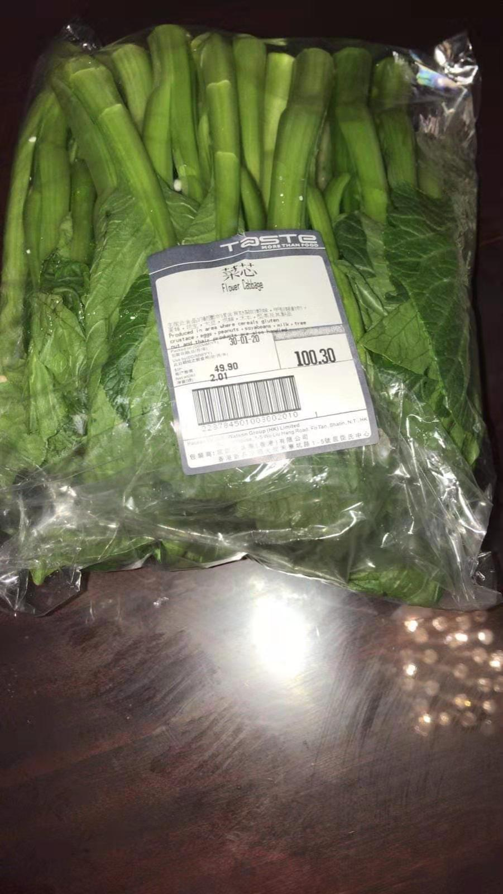

今天是 2020 年 2 月 2 日，本来今天是我在 2019 年 12 月份已经计划好的巴拉望之旅的第一天，但是被迫取消了，由于目的地 Cebu 海关强迫入境的中国人隔离 14 天。虽然这是 Cebu 政府出台的政策，但是航空公司并没有对应的从中国飞 Cebu 的退票政策，真是丢了时间又赔钱😭。

由于当地医疗条件落后，要是病毒爆发，政府根本无能为力，只能等着别国救助。这也是世界卫生组织担心的，病毒入侵落后国家。这个是可以理解的。

----

时至今日我现在终于深刻体会什么叫蝴蝶效应：

1. 一个人贪吃，吃了野味（可能是蝙蝠）
2. 感染了冠状的病毒
3. 传染给身边的人
4. 政府隐瞒疫情
5. 蔓延全国
6. 蔓延海外
7. 武汉封城，湖北封省
8. 社会生产恢复时间不断延后
9. 中小企业困难
10. 疯抢口罩
11. 疯抢双黄连
12. 红会丑闻
13. ...

**那个吃蝙蝠的人，无论如何都想不到吧，吃个蝙蝠搞出这么大的一出，他就是那只在南美洲亚马逊河流域热带雨林中的蝴蝶。**

每个人都有各自的不幸，例如就是我的旅行计划泡汤，延迟了开年计划。但更加意想不到的估计是双黄莲蓉月饼和红会吧。😄

----

其实今天对我来说也算是不幸中的万幸，因为刚刚得到了消息：

这两个人从武汉到菲律宾旅游，旅游路线都和我计划的差不多，出发的时候估计并不知道自己已经携带了病毒，谁知道这一路是传染了多少人：同一个航班的人，一路上的行人、导游、餐厅、商场，航班的人也会活动...真是细思极恐。加上人在国外，人生地不熟，不到最后一刻都不去医院，拖到最后熬不住就死掉了，节哀。🙏

----

最后说说我对这次疫情的一些观察：

**一**

Q：这个病毒很厉害吗？

A：厉害也不厉害。

厉害的地方在于潜伏期长，而且潜伏期同样有传染性。也就是说一个感染病毒的人可以在不知不觉之中传染给很多人：1 -> 2 -> 4 -> 8 -> 16 ... 这就是传说中的指数型增长传播。

**如果传播到医疗水平差的国家，那将会是灾难，因为这个病引起的是肺炎，如果不能很好低做自身过度免疫的抑制治疗，最终可能是自身免疫细胞将肺部灭了，死于窒息。** 想想都可怕。😱

不厉害的意思是致死率比较低（2%左右，SARS 10%，鼠疫 100%，霍乱 50%），年轻人靠抵抗力可以扛过去，但是老人家就不好说了。

**二**

Q：这次疫情会对社会未来带来什么影响？

A：扛过去了会有更好的未来。国家的力量也足够扛过去。

这次疫情暴露了很多问题，例如政府隐瞒疫情，红会的腐败，社会恐慌等。这些问题都要暴露出来，让全社会的年轻人参与讨论，推动改革。

政府过去的闭门做事的方式逐渐行不通了，年轻人也渴望参与社会建设和管理，期望有更透明的方式，期望有更好的社会未来。也许武汉政府这次隐瞒疫情的出发点不是坏的，打算自己闭门把疫情掩盖了，事实看来这样没有控制住这次疫情，~~甚至保不住隐瞒的人的乌纱。可以想象有多少次这样闭门处理疫情的情景了，只是这次瞒不住~~。

红会的问题已经不是一天两天了，这里不想多说什么。希望这次事件让政府有解决红会问题的决心，否则还会有下一次。

**社会恐慌** 是把双刃剑，甚至会被适当地放大。例如这次疫情，国家为了不让大家出门，将恐慌放了很大，这样大家都不出门了，从而阻隔病毒传播。

那既然是把双刃剑，就不可能不会伤害自己，满天飞的谣言就是了。普通的谣言就算了，那些说按照什么偏方做就可以不戴口罩就是麻烦事了。出现的物资抢购也是恐慌现象之一，一旦人感受到有东西威胁到自己生存基本需求的时候，就无法保持理智并且开始抢购物资。为什么说国家的力量足够，看看现在，虽然多地封路，社会生产停止了大部分，但是粮食、生活用品依然供应充足，并且物价控制的很好（相对的，香港的菜已经 100 港币一 kg 了），这就是国家力量。君不见多少国家一旦控制不住恐慌，物价暴涨，人民群众上街打砸抢，陷入长期的社会动荡（拉美国家）。

香港菜心价格

----

总的来说，一个人吃了野味，引发了巨大的危机。虽然看起来是偶然事件，但是值得有更深层次的思考。未来可以控制的住。相比于历史上的大规模传染病案例，这次疫情不算太严重（毕竟有鼠疫、霍乱、天花在前）。但是如果控制不当的话，恐慌控制不住，最终还是会导致社会动荡的。希望一切顺利。

顺便提一下，大家在家里呆了很长时间了，在不久的将来将释放一大批被压制的消费需求，那也是一次赚钱机会。😀

人类会不会停止吃野味？我认为不会，就算不吃野味人类也还会通过其他途径得到变异的可传染的病毒的。所以这次不太严重的事件给足我们这个社会应对下一次蝴蝶效应的经验。

End
