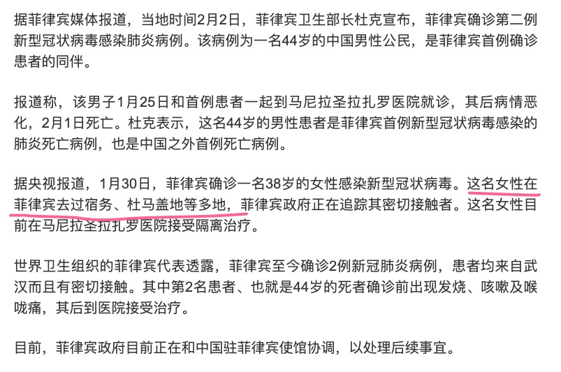

2020 年 2 月 2 日，本来是我的巴拉望之旅的第一天，但由于疫情被迫取消了。

因为一个人吃了蝙蝠（现在看起来是蝙蝠传给穿山甲，然后人吃了穿山甲，02/21/2020 修改），搞得我旅行计划泡汤，这是多么深刻的蝴蝶效应：

1. 一个人吃了野味（可能是蝙蝠）
2. 感染了冠状的病毒
3. 传染给身边的人
4. 政府隐瞒疫情
5. 春节春运高峰，500万人离开武汉到全国各地，甚至海外旅行
6. 武汉封城，全国戒严
7. 社会生产工作不断推迟
8. 中小企业困难
9. 疯抢口罩
10. 疯抢双黄连，以及双黄莲蓉月饼
11. 红会丑闻
12. ...

**那个吃蝙蝠的人，无论如何都想不到吧，吃个蝙蝠搞出这么大的一出，他就是那只在南美洲亚马逊河流域热带雨林中的蝴蝶。**

----

对我来说，不幸是，是旅行计划泡汤。不幸中的万幸是，刚刚得到的消息：

仔细想一下，这两个人从武汉到菲律宾旅游，旅游路线都和我计划的差不多。他们出发的时候估计并不知道自己已经携带了病毒，谁知道这一路是传染了多少人：同一个航班的人，一路上的行人、导游、餐厅、商场，航班的人也会活动继续传播...真是细思极恐。加上人在国外，人生地不熟，不到最后一刻都不去医院，拖到最后熬不住就死掉了，节哀。🙏

