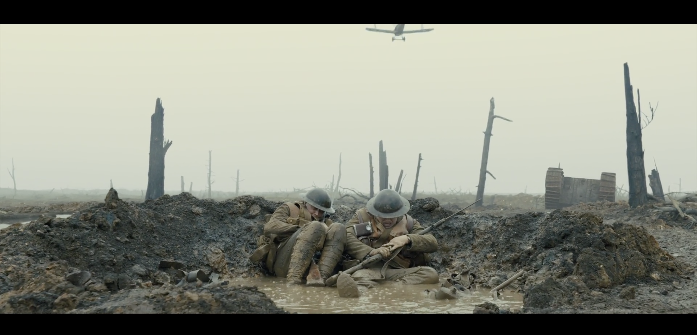
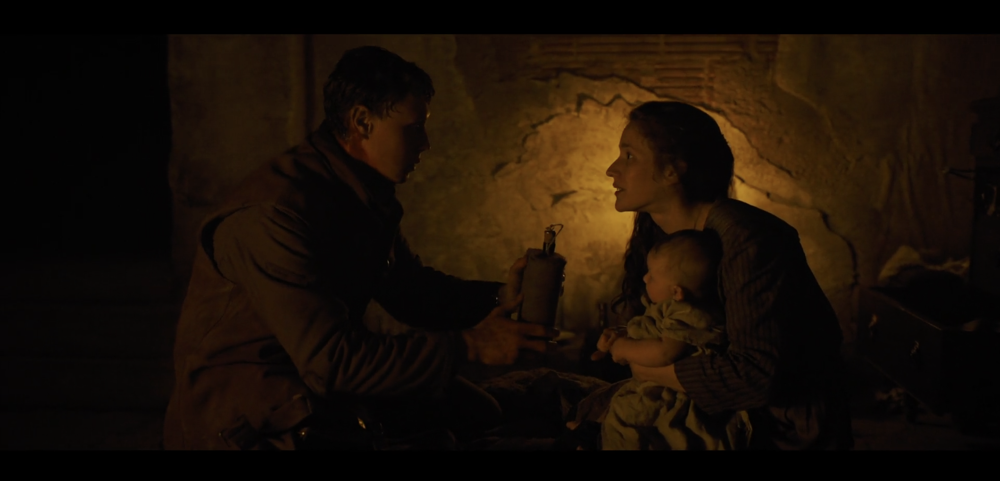

第一次看“一镜到底”的电影。作为普通观众，写一下感受吧

故事大概讲述的是，在 1917 年世界大战期间，两个小伙子需要将后方一个将军的命令，送到前线另一个将军的手中，中止他们的进攻，因为那是德国人撤退战术陷阱，这样可以拯救 1600 名士兵的生命。

剧情是典型的写实战争片，通过“一镜到底”的展示方式，全程跟着主角前进，进入进去不同的场景，都非常连贯顺滑，沉浸式的观感体验，十分值得观看看。观看的过程给我带来了很大的震撼，内心满是“这真TM的刁”的感叹。

后来看了花絮，原来是通过 22 个分镜剪辑合并在一起的，技术足够厉害。

----

穿越前线

生命与死亡

德军火烧民居

遭殃的，在避难的普通民众

尸体与森林

----

我们生活在和平时期真好。

可惜人类总会挑起战争，历史告诉我们，人们从来不会在历史中吸取教训。

希望和平可以尽量长一些吧。
