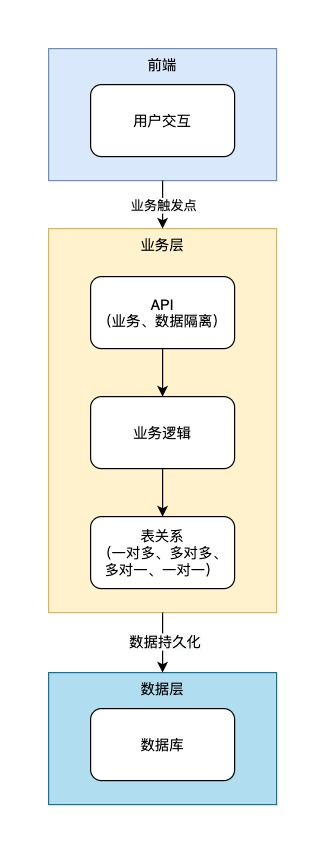

## 1. 前言

在过去的 2020 年，我参与到低代码平台的建设中。这里记录一下个人看法。

---

## 2. 什么是低代码

我个人见解：指「用更少的代码量即可满足同等的业务需求的技术」。`低代码`的「`低`」是相对的。

react 相对于 html+css+js 开发是低代码，java 相对于汇编、C 是低代码...

我们一直就在追求更快的开发效率。

---

## 3. 什么是低代码平台

### 3.1. 低代码开发平台

> **低代码开发平台**（英语：low-code development platform，简称**LCDP**），是一种方便产生[应用程序](https://zh.wikipedia.org/wiki/应用程序)的平台[软件](https://zh.wikipedia.org/wiki/软件)，软件会开发环境让用户以图形化接口以及配置编写程序，而不是用传统的[程序设计](https://zh.wikipedia.org/wiki/程序设计)作法。

低代码开发平台面向的群体依然是程序员们。平台的内核还是提供基础能力，加快业务迭代效率。

我们比较成熟的：

- AWS 亚马逊云
- 微软云
- 阿里云
- ...

他们的核心是提供「计算 + 存储 + 运维」的基础能力。

也被称为 IaaS。

### 3.2. 业务低代码平台

目前业界在宣传的基本是业务低代码平台，例如：

- 云品秀
- 简道云
- 明道云
- JEPaaS
- 宜搭
- 氚云
- ...

他们的核心是提供「业务设计 + 页面设计 + 多租户」的能力。

也被称为 PaaS。

---

## 4. 业务和业务信息化

业务究竟是什么？业务（ business ）是如何盈利的过程或事物如何流转的过程。所以业务的核心是`过程`。

想将`业务信息化`，需要专业的知识：数据库基础知识、SQL、表关系、编程语言、API、用户交互...才能做好。

> 我有一个绝妙的 idea，就差一个程序员了。

将业务信息化，需要的专业技能太多了。对于一个懂业务，但是不具备那么多专业知识的人，最大的问题就是能否 __轻松将业务信息化__ 。

回顾我们是如何做业务信息化的：

1. 业务需求分析
2. 数据建模
3. 系统建模
4. 业务编码开发
5. UI 交互开发

在这过程中我们积累了许多年的经验，沉淀了 MVC 架构、数据驱动、模型驱动、用户体验相关等各种可复用模型。

业务低代码平台就是`可视化沉淀信息化业务`的平台，进一步降低`业务信息化的技术门槛`。

### 4.1. 数据建模

一个信息化业务系统最有价值的部分，是数据建模。业务低代码平台最核心的部分，也是可视化数据建模。

数据建模具体的输出是 `数据表 -> 表关系`。

### 4.2. 页面设计

页面是承载用户交互的容器。也是绝大部分信息化系统的业务触发点。

### 4.3. 前后端分离

信息化系统的本质是 __数据可视化__。

数据、可视化，这是两样东西，分别代表着绝对理性和人类感性。

虽然现在前端的能力越来越强，甚至处理了部分数据业务逻辑，在浏览器做连表操作，odata 就尝试过。

但是这样并不正确。

正确的前后端分离，应该是数据和可视化的分离。

前端永远只处理交互逻辑，业务逻辑永远放在后端，通过 API 将两者结合。

### 4.4. 业务中台

处理业务的地方，就是业务中台。

所谓中台，对应是前台、后台，但其本质依然是后端服务，毕竟浏览器的能力就这样。前端是客户端，后端是服务端。混在一起理解的，就是理解不到位。

业务是最复杂的部分。

所以在业务低代码平台最有价值的部分也是可视化业务设计这部分。

---

## 5. 应用

绕了一圈，我们最终想要的，其实还是应用。

可以最传统的从头构建，可以基于 IaaS，基于 PaaS，甚至是 SaaS 搭建。

行业竞争激烈，企业期望快速、低成本交付业务应用，于是我们不断在做尝试：更高级的语言、框架、设计模式、工具库、低代码平台、智能语义分析构建应用...

低代码平台不是终点，不过是人类的这场游戏中的一个环节吧。

<!-- ## 5. 业务低代码平台本身的技术方案

上面讨论的都是低代码平台是什么，以及存在的意义，现在来探讨下，业务低代码平台本身的技术方案。

聪明的程序员老哥们一般都会想到 2 种方案来实现：

1. DSL 流派
2. 代码生成流派

这里并不展开讨论哪种流派更好，我只直接说结果：我们选择了走「代码生成流派」。我们在做业务低代码平台方案的时候，尝试走过一段 DSL 流派的路，最终某些原因还是将方向转向了代码生成流派。

这里不得不思考以下几个关键问题：

1. 业务是无限可能，如何能设计无限承载业务的系统机制？
2. 新业务的开发，如何确保应用的可扩展与可维护？

我们的答案是，如何通过程序员的手开发的业务代码，我们便如何生成业务代码。也就是说，我们的业务低代码平台，是赋予不太会写代码的、但是又熟悉业务的人员，快速生成与资深程序员老哥的手写出来的业务代码一样的能力的平台。

我们依然遵循着技术发展的规律：降低技术门槛、提高业务迭代效率。

## 6. 低代码的未来

换一个提问方式可能会友好一些：技术的未来。

技术的未来是没有代码吗？并不是。技术的未来一定是通过很简单的语言描述，即可将系统与现实业务打通。例如我通过一段人类的语言描述：“我想要一个电网网站，包含xxx功能....”，有一个通用的平台，将我这段话直接转换成我想要的直接可以使用的系统，这就是技术的未来。

目前有很多平台打着 0 代码的旗号，宣传着他们的技术多厉害，在我看来基本上是骗子。因为「代码」本身只是一段功能描述，如果将「代码」换成「语言」，那么大众也许更容易接受。0 代码，就是 0 语言，也许等到脑机实现的一天，或者我们的意识都上传到系统的一天。我争取活到那个时候吧。

好了，最后谢谢你看到这里😊。 -->