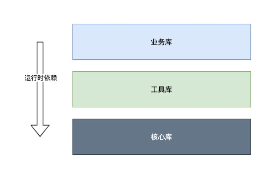

## 动机

纯前端的小伙伴对运行时和编译时依赖的概念比较模糊，所以这里想分享一下其中的原理，与感兴趣的前端小伙一起探讨，同时让我们前端小队成员更深入地了解我们的低代码平台的前端架构。

## What

运行时依赖？编译时依赖？纯前端的小伙伴应该对此比较陌生。其实在成熟的后端语言都属于常识了。

如果这里用前端的话术来描述，可能就很容易理解了：

1. 编译时依赖：将工程中所依赖的模块与我们开发的模块一起进行编译。例如 `import React from 'react'`（webpack 中不设置 externals）。这个时候就是编译时依赖 `react`。
2. 运行时依赖：代码在运行到某一行时，通过使用全局对象 `window` 的某个模块，例如 `window.react`。这个时候就是运行时依赖 `react`。

### 编译时依赖

最直白的其实就是将前端 npm 工程中的 `package.json` 中的 `dependencies` 下的所有项，与我们开发的代码一起构建了。

举个例子：

```tsx
import React from 'react'
import ReactDOM from 'react-dom'

const App extends React.Component {
  render() {
    return (
      <div>Hello</div>
    )
  }
}

ReactDOM.render(<App />, container)
```

这里假设使用了 webpack 进行构建，没有使用 externals 配置将 react 和 react-dom 分离的话，就等于业务模块 `App` 在编译时依赖了 react 和 react-dom。

目前开源社区中很 hit 的前端工程脚手架 `create-react-app`，隐藏了 webpack 的配置细节，开箱即用的，门槛较低。同时也将所有模块都通过编译时依赖的方式进行构建，项目规模小的情况下，还是很好用的，但是随着项目规模扩张，就不够了。需要手动将 webpack ejest，再根据项目进行定制。

当然也有一些脚手架优化的比较好，例如 `nextjs`，`gatsbyjs` 等。这里也不详细讨论。

### 运行时依赖

通常，我们可以通过 CDN 获取我们所依赖的、稳定版本的三方库，我们编写的业务库需要在依赖的库加载完成后再加载。

> 例如我们通过 CDN 加载 react，我们的业务代码库紧跟其后：

```html
<script src="https://cdnjs.cloudflare.com/ajax/libs/react/17.0.1/umd/react.production.min.js"></script>
<!-- 业务代码 -->
<script src="https://biz-code.js"></script>
```

这个时候我们的业务库 `biz-code` 就是在运行时依赖 `react`。这个概念对如何进行业务分离很重要，并且接下来将分享几个个人观点：

1. 前端开发对构建和依赖概念陌生的缘由（非重点）
2. 如何通过运行时依赖__设计高度可扩展的业务架构__。（重点）

---

## 前端工程的现状

就目前而言，大部分互联网 web 软件项目都是简单业务。（毕竟互联网产品的生命周期超过三年的就算是成功了😊）

当项目规模很小的时候，如何开发都问题不大。开源社区有很多优秀的脚手架（例如 create-react-app、umi），快速开发业务不再困难。脚手架要做的，就是尽可能的降低前端开发的入门门槛，提高行业的业务迭代效率，从而提高整个社会的效率（国外就有很多优秀的 SaaS，都是通过快速迭代出现的）。

所以在实现脚手架最好的途径就是直接将所有代码一起编译，简单粗暴，因为编译时依赖是最简单的管理方式。

### 问题

可是，一旦项目到了一定规模，依赖会越来越多，直到依赖纠缠不清，构建速度也会越来越慢，调试将越来越难。最终的结果就是，团队将花很多的时间整理各种依赖，排查各种依赖紊乱导致的问题，技术成了业务增长的瓶颈。最终归结为工程依赖管理的问题。

> 我们团队也遇到了同样的问题了，所以我们需要学习更成熟的方案，思考如何解决。

### 解决思路

在实际工程中，绝大部分的三方依赖是不会被我们改动的。我们其实并不需要在编译的时候依赖这些库。

所以构建工具 webpacck 提供 externals 配置，帮助我们将三方库从工程开发中分离出来...

例如：

```json
/// webpack config
/// 这里不详细解释这个原理
{
  "externals": {
    "react": "React",
    "react-dom": "ReactDOM",
    ...
  }
}
```

> 当然这里只是第一步，但是也是关键的一步。

## 做正确的事

有了上述的初步认知，我们可以定制符合可扩展的前端工程：



### 核心库

我们可以最稳定的、最底层的依赖归类核心库，例如 react, react-dom。

### 工具库

我们可以将基于核心库（也可以不必）扩展而来的三方库归类工具库，例如 material-ui, react-router。

### 业务库

顾名思义，这一类就是我们针对业务开发的业务代码。同时还可以针对不同的业务场景进一步对业务库进行切割，按照业务功能来继续划分。

## 业务架构

对于业务库的进一步划分，才是整个业务系统有真正意义上的架构。

对于架构的看法，这里我引用《The art of scalability》的观点：架构要对系统的可扩展性、稳定性负全责。什么是可扩展性？就是随着业务的增减，可以通过动态增减人员来满足业务变动的需求，即使人员有变动，系统依然可以稳定运行。_所以__架构__并非一个单纯的技术问题，而是技术 + 人事的问题。_

那么有什么办法可以做到？

### 设置分离点

什么是分离点？就是将模块与模块之间切底隔绝。想象一下，我们是如何与三方服务对接的？例如接入微信支付、支付宝支付？我们是通过文档与其做技术对接。三方服务将提供 SDK，我们将集成于我们的业务系统之中。

所以，分离点就是将模块分拆成独立服务，并且对外提供 SDK 和对接文档。

当然，每增加一个分离点，人力成本就会上升，对应的管理难度也会上升。所以依然还是要清楚认识到自身所在的组织的能力上限在哪里、业务需求增长量在哪里，扩展点在哪里，才能更好的定制分离点。

当我们确定好分离点以后，就可以通过`运行时依赖`，将由团队编写的服务或库按照依赖顺序串联起来，组成稳定的系统。

## 总结

以上内容希望对大家有所帮助。虽然目前的前端是指浏览器，但是我们不应该局限在浏览器。谢谢。

