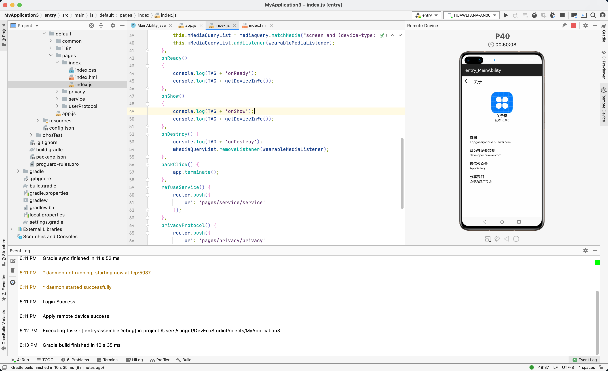

趁着放假的时间，来体验一把华为 HarmonyOS（鸿蒙）的应用开发。

总的来说，该有的都有了，主流程没有问题，但开发体验一般，调试很麻烦。

这篇文字将从几个角度来说说看法：

1. 现状
   1. 生态
   2. 系统底层
2. 开发应用
   1. 开发者帐号
   2. IDE
   3. 应用工程
   4. 应用调试
3. 发布应用
4. 展望

## 1. 现状

### 1.1. 生态

就目前来看，从国际局势来看，生态基本是靠中国的开发者来建设了，或者说要通过中国的影响力来建设了。

我个人目前能看到的事实是：

1. 刚刚起步阶段
2. 工具不完善
3. 系统并未普及
4. 兼容方舟编译器编译的 android 应用

这些不足都是机遇，就像当年的 android 和 ios 开发者，微信公众号的前期运营者，都能有很不错的发展。不过这些平台都是增量发展，而华为搭的鸿蒙平台更像存量竞争，直接对手是 android 和 ios，存量竞争并不容易，前景也不会像增量市场那样。

不过生态发展需要时间，提早加入生态的建设。

### 1.2. 系统底层

系统与 android 还是有本质的区别的。android 是 macro kernel ，应用基于 JVM 运行，HarmonyOS 是 micro kernel ，通过方舟编译器将应用编译成二进制机器码。

类比跨平台方案，差不多是 react native 和 flutter 的区别。

HarmonyOS 和 ios 有类似的策略点，都是一套系统兼容大部分设备（不仅限于手机），这里我个人觉得智能硬件是个不错的方向。

## 2. 开发应用

### 2.1. 开发者帐号

首先需要，按照官方流程申请开发者帐号，否则后续的远程调试无法使用的。

### 2.2. IDE

华为的 IDE 叫 DevEco，和 android studio 一样是基于 intelliJ 的 idea 的编辑器，习惯 intelliJ 的产品的应该很容易上手。不过谈不上多好用，手感没有 vscode 好。

开了一阵子我的 mac 的风扇就开始疯狂转动，应该是某些地方没优化好吧。

还有很麻烦的一点，每次重新进入 IDE 的时候都需要重新登录，不登录是无法进行远程模拟器调试的。可能出于什么安全考虑不记录用户？但是这样体验感受很不好。

### 2.3. 应用工程

应用工程提供了 js 和 java 版本的，js 的其实跟传统的 web 模板类似，是 js + html 模板 + css 的形式。java 的就和 android 的差不多，大同小异。

整体工程无论是 js 还是 java 的，其实都是 java 的工程。

### 2.4. 应用调试

目前只支持真机或远程模拟器进行调试，本地模拟器华为还在制作中。

因为我没有华为的设备，所以用的是远程调试器。总的来说体验感不好，很慢很卡，我的网络已经是 1000 兆的，这种做 demo 可以，但无法用于工业级标准化的应用生产。

## 3. 应用发布

发布我还没走到这一步，不过应该是直接发布到华为的应用商店的，应该和 google play 或者 app store 类似的 huawei store，不过我并没有体验这个流程。

## 4. 展望

也许华为并不是要和 android 和 ios 竞争存量市场，而是想要通过一个系统打通所有硬件。但是这一步 android 和 ios 也已经走了很远了。

如果出于国家战略、长远规划而言，鸿蒙至少可以占据国内相当一部分的市场，早期进入的开发者应该也可以分到一杯羹，国家再通过自身的影响力，也可以让世界其他国家顺应。

希望这次华为可以走的很远。

我觉得可以试试智能硬件的方向，不一定走手机应用，毕竟这条赛道已经很成熟了。
